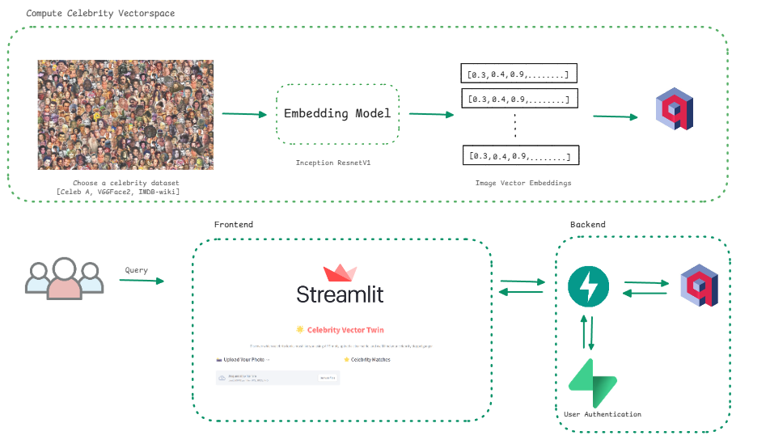

# Vector Twin 🎭  
**Find Your Celebrity Look-Alike with AI-Powered Vector Search**  
Vector Twin is a fun and interactive platform that uses AI to match user-uploaded images with their closest celebrity look-alikes. 



---

## 📋 Features  
- **Celebrity Look-Alike Matching:** Upload your image and find your top matches with similarity scores.  
- **Real-Time Results:** Get results in seconds, thanks to optimized backend processing.  
- **Scalable Design:** Built to handle high-dimensional embeddings efficiently.  
- **User-Friendly Interface:** Simple and intuitive design powered by Streamlit.  

---

## 🛠️ Tech Stack  
### **Frontend**  
- **[Streamlit](https://streamlit.io/):** For building a responsive and interactive user interface.  

### **Backend**  
- **[FastAPI](https://fastapi.tiangolo.com/):** For handling API requests and backend processing.  

### **Database**  
- **[Qdrant](https://qdrant.tech/):** A high-performance vector search database for querying embeddings.  

### **Authentication**  
- **[Supabase](https://supabase.com/):** To secure user data with authentication and role management.  

### **Machine Learning**  
- **[FaceNet](https://github.com/davidsandberg/facenet):** For generating 512-dimensional image embeddings.  

---

## 🚀 How It Works  
1. **User Upload:** Upload an image through the Streamlit frontend.  
2. **Embedding Generation:** The image is processed to generate a high-dimensional vector using FaceNet.  
3. **Similarity Search:** The vector is compared with celebrity embeddings stored in Qdrant using cosine similarity.  
4. **Results Display:** The top matches with their similarity scores are displayed in the frontend.  

---

## 🧰 Installation and Setup  
### Prerequisites  
- Python 3.9 or later  
- pip or conda for package management  

### Clone the Repository  
```bash
git clone https://github.com/yourusername/vector-twin.git
cd vector-twin
```

### Create a Virtual Environment  
```bash
python -m venv myenv
source myenv/bin/activate   # On Windows: myenv\Scripts\activate
```

### Install Dependencies  
```bash
pip install -r requirements.txt
```

### Set Up Environment Variables  
Create a `.env` file in the root directory and add the following variables:  
```plaintext
QDRANT_API_URL=<Your Qdrant API URL>
QDRANT_API_KEY=<Your Qdrant API Key>
SUPABASE_URL=<Your Supabase URL>
SUPABASE_KEY=<Your Supabase Key>
```

---

## 📂 Project Structure  
```plaintext
vector-twin/
├── backend/
│   ├── app.py            # FastAPI backend
│   ├── auth.py           # Supabase authentication logic
|   ├── embeddings.py     # FaceNet embedding generation
├── frontend/
│   ├── app.py            # Streamlit app   
├── requirements.txt      # Python dependencies
├── README.md             # Project documentation
├── .env                  # Environment variables
├── docker-compose.yml      
```

---

## 🔧 Configuration  
### Qdrant Vector Collection  
- **Collection Name:** `celebrity_embeddings`  
- **Vector Size:** `512`  
- **Distance Metric:** `Cosine`  

The collection is preloaded with celebrity embeddings for similarity searches.  

---

 
